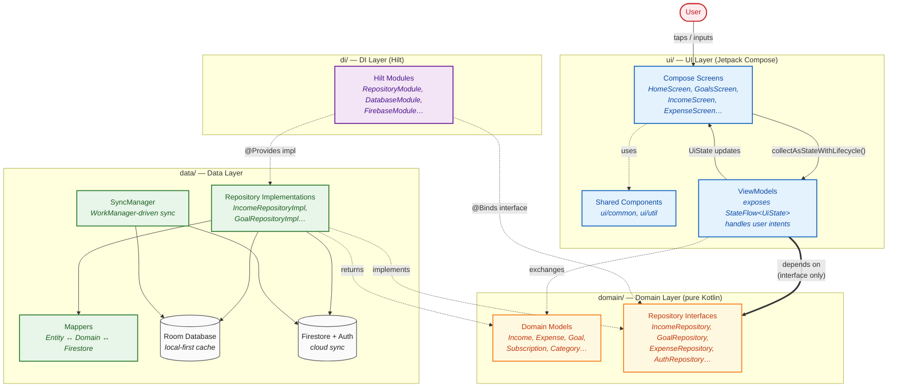
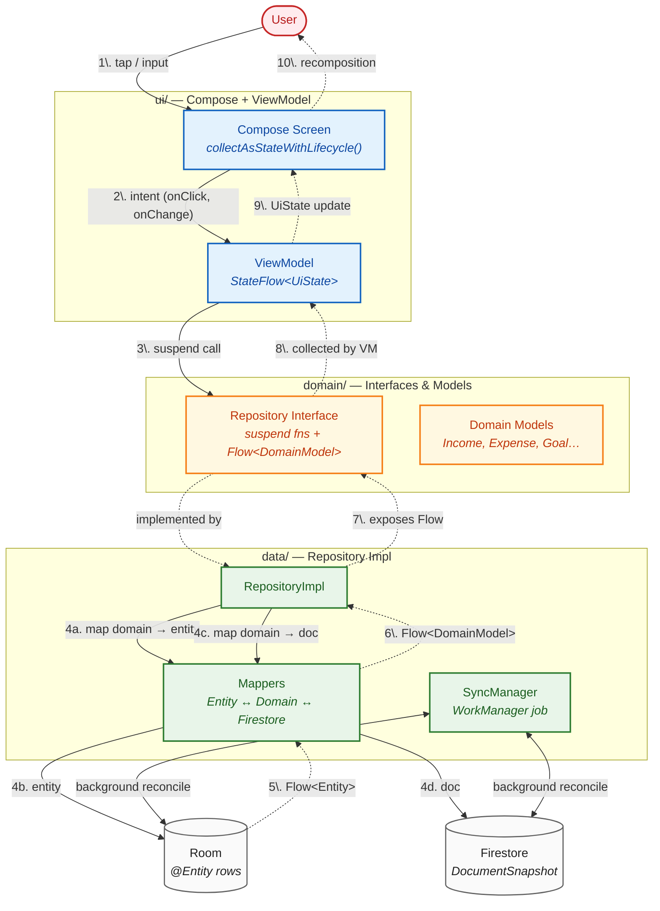
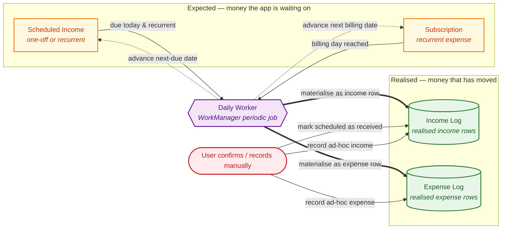
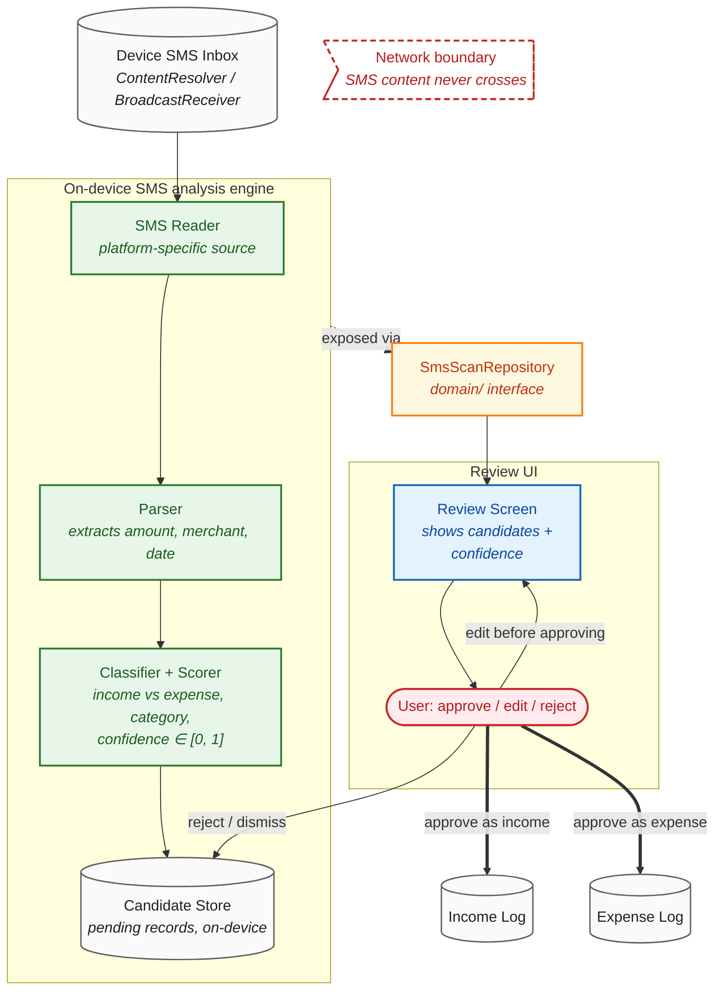

# Architecture

## Overview

Kahavanu is a single-activity Android app built with Kotlin and Jetpack Compose. The app follows MVVM and uses a layered structure with repositories mediating between UI and data sources.

## Layers

- **UI layer** — Compose screens, ViewModels, shared components, and pure helpers in `ui/`.
- **Domain layer** — Models and repository interfaces in `domain/`.
- **Data layer** — Repository implementations, Room DAOs, Firestore sync code in `data/`.
- **DI layer** — Hilt modules in `di/`.

## MVVM architecture

The diagram below shows the four packages and the direction of their dependencies. ViewModels depend only on the repository interfaces declared in the domain layer; the data layer supplies the implementations, which Hilt wires together. This inversion keeps the UI and the data sources independent of each other.

**How to read the diagram**

- **Solid arrows (→)** are compile-time dependencies (the source package `import`s from the target).
- **Dotted arrows (⇢)** are runtime relationships (implements, returns, wires up).
- **Bold arrow (⇒)** highlights the central inversion: `ViewModels` depend on `domain/` interfaces, *never* on `data/` classes directly.

**Key points**

- **UI → Domain only**: ViewModels reference `domain/repository/` interfaces and `domain/model/` types; they never import from `data/`.
- **Data → Domain only**: Repository implementations in `data/` implement the interfaces declared in `domain/` and return domain models — Room entities and Firestore snapshots stay inside `data/`.
- **DI binds the two**: Hilt modules in `di/` provide the concrete `data/` implementations wherever a `domain/` interface is injected, so swapping the data source (e.g., for tests or a new backend) requires no UI changes.
- **Domain has no outgoing dependencies** on UI, Data, or DI — it is the stable core that the other layers point at.

Key points:

- **UI → Domain**: ViewModels reference only `domain/repository/` interfaces; they never import from `data/`.
- **Data → Domain**: Repository implementations in `data/` implement the interfaces declared in `domain/` and return domain models.
- **DI binds the two**: Hilt modules in `di/` provide the concrete `data/` implementations wherever a `domain/` interface is requested.
- **Domain has no dependencies** on UI, Data, or DI — it is the stable core that the other layers point at.

## Data flow

The diagram below traces a single user interaction through the stack and back. The **write path** (solid arrows) flows downward from the UI through the ViewModel and repository into Room and Firestore. The **read path** (dashed arrows) flows upward as a reactive `Flow` from Room, mapped to domain models in the repository, collected by the ViewModel into a `StateFlow<UiState>`, and rendered by the Compose screen. `SyncManager` runs out-of-band, reconciling Room with Firestore on its own schedule.

**How to read the diagram**

- **Solid arrows (→)** are the write path: a user intent travels down through the layers until it lands in Room/Firestore.
- **Dashed arrows (⇢)** are the read path: data flows back up reactively as a `Flow`, ending in a recomposition.
- **Numbered steps (1–10)** trace one round-trip from tap to UI update.
- `SyncManager` is detached from the user-driven flow — it reconciles Room and Firestore on its own WorkManager schedule.

**Invariants**

- UI triggers actions → ViewModel → Repository → data sources. UI code never reaches Room or Firestore directly.
- UI observes state via `StateFlow` using `collectAsStateWithLifecycle()`.
- Repositories expose `Flow` and `suspend` APIs; everything below the repository interface is implementation detail.
- Only domain models cross the `domain/` boundary — Room `@Entity` and Firestore `DocumentSnapshot` types stay inside `data/`.

## Scheduled → realised pipeline

Money the application *expects* is held as **scheduled income** or as a **subscription**; money that has *moved* is held as a **realised log entry**. The same shape serves both sides: a subscription is the expense-side analogue of a recurrent scheduled income, and is logged automatically on its billing day by the same daily worker that materialises recurrent income.

**How to read the diagram**

- **Left column (yellow)** holds *expectations*: scheduled incomes and subscriptions. Nothing here counts toward balances until it is realised.
- **Right column (green)** holds *realised log entries* — the source of truth for what actually happened.
- **Bold arrows (⇒)** are automatic materialisations driven by the daily worker on the due / billing date.
- **Solid arrows (→)** are user-driven realisations (confirming a scheduled item, or recording an ad-hoc entry that has no expectation behind it).
- **Dashed arrows (⇢)** are recurrence bookkeeping — after materialising, the worker rolls the schedule's next-due date forward.

**Invariants**

- Balances and analytics read from the **realised** logs only. The expected side is forecast/intent, never accounting truth.
- A subscription and a recurrent scheduled income share the same recurrence machinery — the daily worker treats them symmetrically, just on opposite sides of the ledger.
- Manual entry bypasses the expected side entirely; ad-hoc expenses and incomes are written straight to the realised logs.

## SMS analysis engine

The SMS analysis engine inspects incoming bank/transaction SMS on the device and proposes candidate income or expense records. Two properties shape the design:

- **On-device only.** Raw SMS content never leaves the phone. Parsing, classification, and confidence scoring all happen locally.
- **Never auto-commits.** The engine produces *candidates* with a confidence score; nothing reaches the realised logs until the user approves. This keeps the ledger accurate and avoids treating low-confidence guesses as truth.

The engine is reached through the `SmsScanRepository` domain interface, so the rest of the app talks to it the same way it talks to any other repository — feature code never imports the Android SMS APIs, the parser, or the classifier directly.

**How to read the diagram**

- Everything inside the **Engine** subgraph runs on-device. The red dashed **Network boundary** marks what SMS content must *never* cross — no telemetry, no cloud parsing, no remote classifier.
- The engine's output is *candidates*, not realised entries. They sit in a local candidate store until the user acts.
- The **bold arrows (⇒)** from `UserAction` to the realised logs are the only paths that produce real ledger entries. There is no automatic edge from `Candidates` to a log.
- The rest of the application reaches the engine only through `SmsScanRepository`. Swapping the platform reader (e.g. for tests or a future non-Android target) requires no changes outside `data/`.

**Invariants**

- SMS content stays on-device. Only user-approved, structured records (amount, category, date — already domain models) participate in the normal repository → Room → Firestore sync.
- No candidate becomes a realised entry without an explicit user action. Confidence score informs ranking and UI emphasis, never auto-approval.
- Feature code depends on `SmsScanRepository` (domain), never on Android SMS APIs, the parser, or the classifier directly.

## Offline and sync

- Room provides local persistence and immediate UI data.
- Firebase Auth + Firestore provides cloud sync.
- Sync is orchestrated through `SyncManager` and WorkManager.
- Conflict resolution prefers the Firebase version on timestamp basis.

## Navigation

- Navigation Compose with a single activity ([`MainActivity`](../app/src/main/java/com/kahavanu/MainActivity.kt)).
- Destinations are sealed objects in `AppDestination` and wired in [`AppNavGraph`](../app/src/main/java/com/kahavanu/ui/navigation/AppNavGraph.kt) and `MainTabsScreen`.

## Theme system

The Compose theme is driven by Material 3 and an extended-colors composition local:

- **`KahavanuTheme`** ([Theme.kt](../app/src/main/java/com/kahavanu/ui/theme/Theme.kt)) wraps `MaterialTheme` and provides `LocalExtendedColors`.
- **`MaterialTheme.colorScheme.*`** — Material 3 standard slots (primary, surface, outlineVariant, …). Values are defined in [Color.kt](../app/src/main/java/com/kahavanu/ui/theme/Color.kt) as hex literals (no raw-palette indirection).
- **`MaterialTheme.extendedColors.*`** ([ExtendedColors.kt](../app/src/main/java/com/kahavanu/ui/theme/ExtendedColors.kt)) — semantic tokens that don't fit M3 slots: brand tonal scale (`brandWashed` → `brandDark`), `accentIncome`/`accentExpense`, the category palette, decorative glow/gradient tokens.
- **Top-level `val`s in `Color.kt`** — the same tokens exposed as constants for non-composable scopes (ViewModels, util fns).
- **`KahavanuTypography`** ([Type.kt](../app/src/main/java/com/kahavanu/ui/theme/Type.kt)) — standard M3 mobile scale with Inter font. Title-medium/small and all label styles use Medium weight per M3 spec; the rest use Normal.

Rule of thumb: composables prefer `MaterialTheme.colorScheme.*` / `MaterialTheme.extendedColors.*`; ViewModels and helpers use the matching top-level `val` from `Color.kt`. There is **no** `RawColors` module.

## Shared UI components (`ui/common/`)

Composables shared across features. Highlights:

- **Layout shells** — `KahavanuScreen`, `KahavanuSubScreen`, `AuthScaffold`, `TopAppHeader`, `BottomNavBar`.
- **Cards & surfaces** — `GlassCard`, `AppSurfaces`, `AppDecorativeGradientOverlay`.
- **Inputs & controls** — `AuthTextField`, `NestedSearchField`, `SearchWithFiltersBar`, `AppToggles`, `AppSelection`, `AppControls`, `FilterBottomSheet`.
- **Buttons** — `AppPrimaryButton`, `AuthButtons`, `MorphingIconButton`, `QuickActionRow` (+ `QuickAction` data class).
- **Lists & headers** — `SectionHeader`, `SectionLabel`, `MatchAndCatch`/`MatchingSection`.
- **Status & feedback** — `StatusBadge`, `EmptyState`, `AppSnackbar`, `BouncingDotsIndicator`.
- **Sheets** — `DetailSheet` (`SheetLabel`, `DetailRow`).

## Pure UI helpers (`ui/util/`)

Pure (non-`@Composable`) helpers usable from any scope, including ViewModels and other helpers. No Compose dependency in their public API.

- [`MoneyFormat.kt`](../app/src/main/java/com/kahavanu/ui/util/MoneyFormat.kt) — `formatAmount(amount, currency, decimals = 2)`.
- [`DateFormat.kt`](../app/src/main/java/com/kahavanu/ui/util/DateFormat.kt) — `formatDate`, `currentMonthLabel`, `dueLabel`.
- [`CategoryPalette.kt`](../app/src/main/java/com/kahavanu/ui/util/CategoryPalette.kt) — `categoryColor(name)` / `categoryIcon(name)` (canonical mapping for expense categories).
- [`GoalCategoryPalette.kt`](../app/src/main/java/com/kahavanu/ui/util/GoalCategoryPalette.kt) — `goalCategoryColor(GoalCategory)` / `goalCategoryIcon(GoalCategory)`.

Note: a few feature-specific helpers (`isPending`, `isRecurrent`, `sourceIconFor`) still live in [`income/components/IncomeUtils.kt`](../app/src/main/java/com/kahavanu/ui/income/components/IncomeUtils.kt) because they encode income-domain semantics, not general formatting.

## Data mapping & transformation

To keep repositories lean and maintainable:

- **Firestore mappers** — Dedicated mapper files (`IncomeFirestoreMappers.kt`, `ExpenseFirestoreMappers.kt`, `GoalMappers.kt`) handle the transformation between raw Firestore `DocumentSnapshot` objects and local Room entities, and between Room entities and domain models.
- **Defensive mapping** — Mappers include fallback logic for field naming variations and type safety for numeric values.
- **Domain at the boundary** — Repository interfaces always return domain models or domain-level types; Room entities never leak through the `domain/repository/` API.
