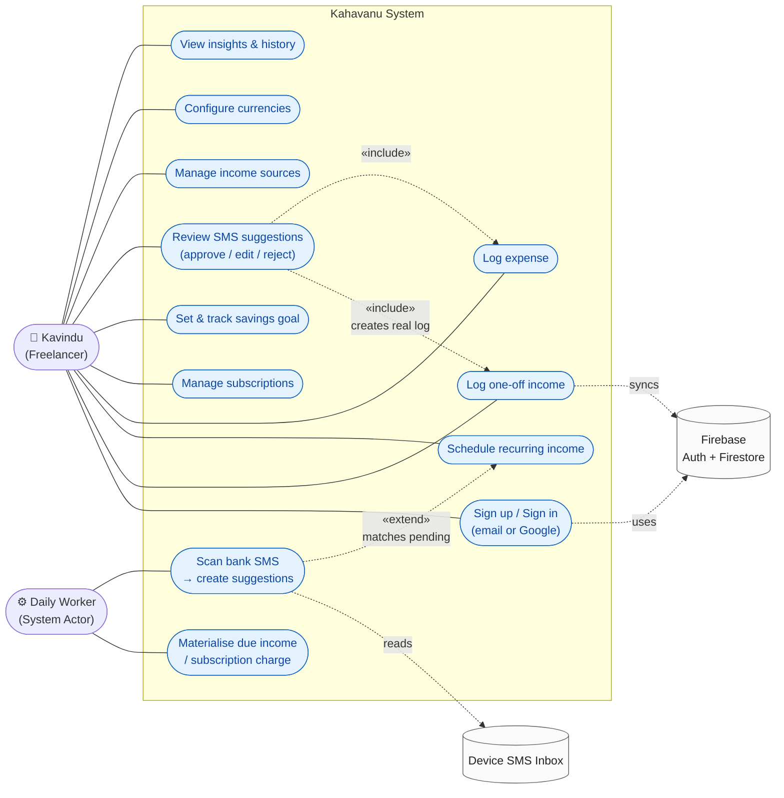
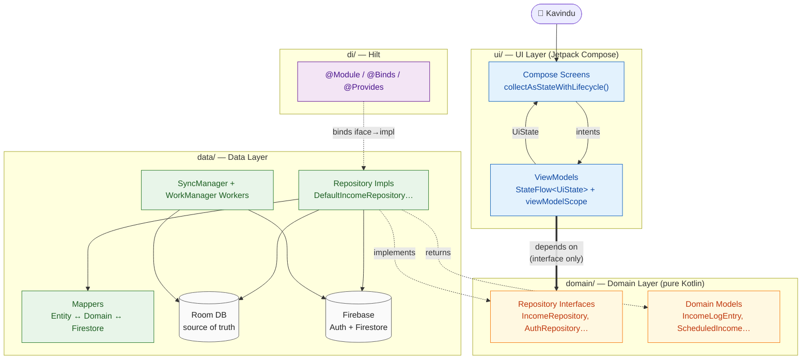
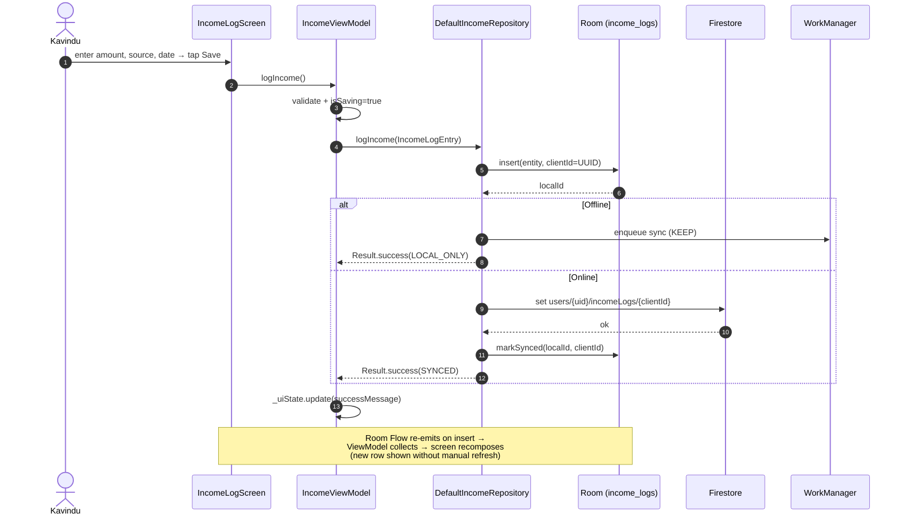
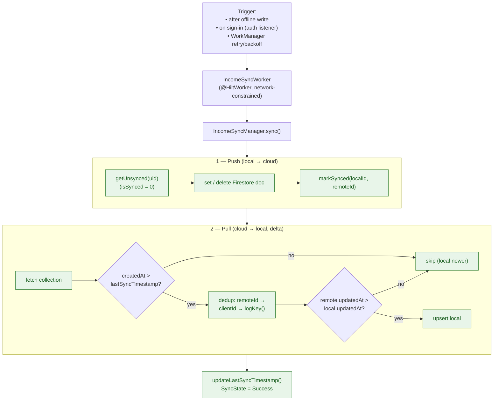
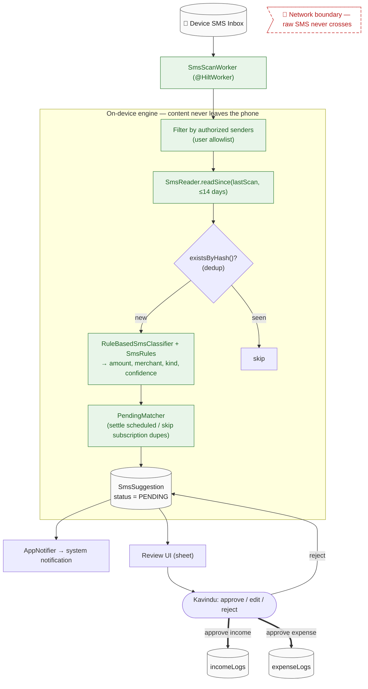
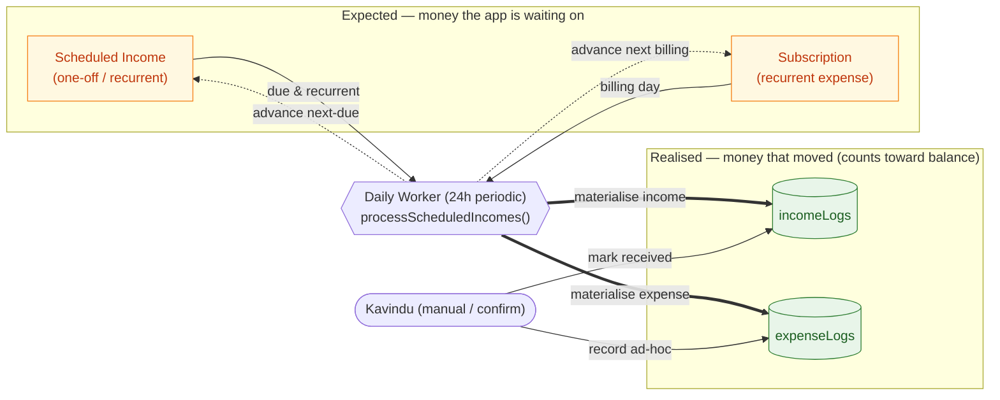
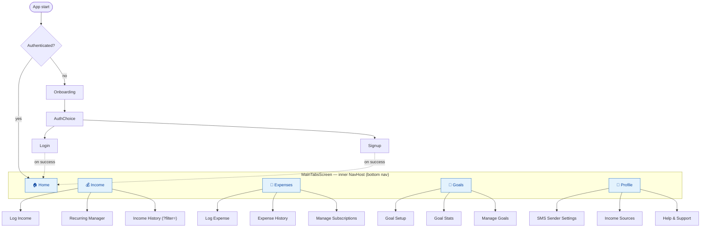

# Kahavanu — Presentation Diagrams

All diagrams are Mermaid. They render on GitHub and in most Markdown/slide tools.
Scenario persona: **Kavindu**, a Sri Lankan freelancer with irregular, multi-source income.

> Tip for slides: paste a single diagram per slide. Use the **speaker notes** under each
> to narrate it. Keep one idea per slide.

---

## 1. Use Case Diagram

Actors: **Kavindu** (primary user) and the **Daily Background Worker** (system actor that
materialises recurring money and scans SMS without user action).

**Speaker notes:** Kavindu drives the foreground use cases. The Daily Worker is a *system
actor* — it materialises due recurring income/subscriptions and scans SMS on a schedule,
with no taps. Note the `«include»`: approving an SMS suggestion *includes* the normal
"log income/expense" use case, so suggestions reuse the same trusted path. SMS scanning is
the only thing that touches the inbox, and it never auto-creates ledger entries.

---

## 2. High-Level Architecture (MVVM, 4 layers)

**Speaker notes:** The one rule — `ui/` and `data/` both depend only on `domain/`, never on
each other (bold arrow). Hilt binds the interface to its implementation at runtime, so the
ViewModel never knows Firestore exists. Swap the backend or inject a fake repo in tests
without touching a single Composable.

---

## 3. Write Path — "Kavindu logs income" (offline-first)

**Speaker notes:** The insert into Room is unconditional and first — that's why the app is
fully usable offline. The network is best-effort; on failure we still return success because
the data is safe locally and a background sync is queued. The UI updates *reactively* via
the Room Flow, not by re-fetching.

---

## 4. Offline-First Sync — push / pull / conflict resolution

**Speaker notes:** Sync is **delta-based** — we only pull docs created after our last-sync
timestamp (kept in SharedPreferences). The three-tier dedup (remoteId → clientId →
amount/date fingerprint) prevents duplicates even for rows created offline. Conflicts are
resolved by **latest `updatedAt` wins** (Firebase-wins on timestamp). On top of this,
real-time Firestore listeners push live changes from other devices straight into Room.

---

## 5. Sieve — On-Device SMS Engine (innovation)

**Speaker notes:** Two invariants — (1) raw SMS **never leaves the device**: parsing,
classification and scoring are all local; (2) **nothing auto-commits**: the engine produces
confidence-scored *suggestions*, and only Kavindu's explicit approval (bold arrows) creates a
real ledger entry through the same repository path as manual entry. The hash check makes
scans idempotent (no duplicate suggestions).

---

## 6. Scheduled → Realised Pipeline (irregular & recurring income)

**Speaker notes:** This is how Kavindu's *irregular* income is handled cleanly. Expected
money (forecast) is kept separate from realised money (truth). Only realised logs feed
balances and analytics, so a scheduled-but-not-yet-received payment never inflates the
balance. The same machinery drives subscriptions on the expense side.

---

## 7. Navigation Map (single activity, two-level)

**Speaker notes:** Single `MainActivity` hosts everything. The outer graph gates auth vs.
main; the inner graph in `MainTabsScreen` holds the five tabs and their sub-screens. Routes
are type-safe sealed objects (`AppDestination`); `IncomeHistory` uses a typed argument.
A single `LaunchedEffect(isAuthenticated)` is the one source of truth for auth redirects.
