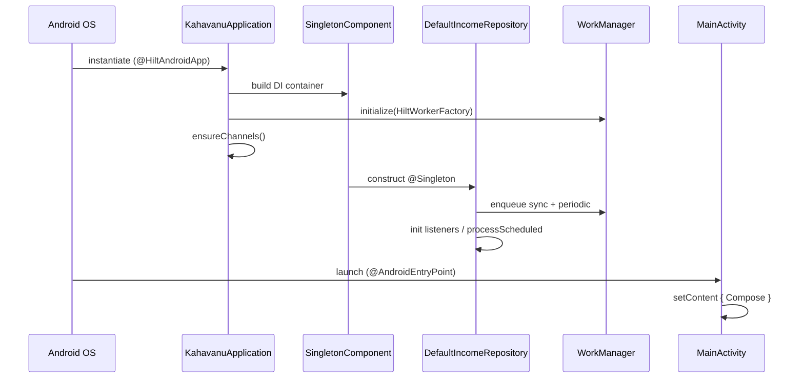

# Kahavanu — Technical Deep Dive

Mechanism-level explanations of *how the machinery actually works*, with code excerpts and
line anchors. This is the document to read when you want to defend the implementation, not
just describe it. Pairs with [concepts.md](concepts.md) (the "what/why") — this is the "how,
exactly."

Contents:
1. [App startup & DI graph construction](#1-app-startup--di-graph-construction)
2. [How Hilt resolves the dependency graph](#2-how-hilt-resolves-the-dependency-graph)
3. [Coroutine mechanics](#3-coroutine-mechanics)
4. [StateFlow mechanics](#4-stateflow-mechanics)
5. [Compose recomposition mechanics](#5-compose-recomposition-mechanics)
6. [Room reactive query mechanics](#6-room-reactive-query-mechanics)
7. [The offline write path, line by line](#7-the-offline-write-path-line-by-line)
8. [The sync algorithm, line by line](#8-the-sync-algorithm-line-by-line)
9. [WorkManager execution model](#9-workmanager-execution-model)
10. [Firebase Task → coroutine bridge](#10-firebase-task--coroutine-bridge)
11. [Auth-state → navigation reactive chain](#11-auth-state--navigation-reactive-chain)
12. [The Sieve pipeline internals](#12-the-sieve-pipeline-internals)

---

## 1. App startup & DI graph construction

What happens between tapping the icon and seeing the first screen.

**Step 1 — Process & Application.** Android creates the process and instantiates the class
named in the manifest's `android:name=".KahavanuApplication"`. Because it's annotated
`@HiltAndroidApp`, Hilt's annotation processor has generated a base class that builds the
**`SingletonComponent`** (the app-wide DI container) before `onCreate` runs.

```kotlin
@HiltAndroidApp
class KahavanuApplication : Application(), Configuration.Provider {
    @Inject lateinit var workerFactory: HiltWorkerFactory   // (a) field injection
    override val workManagerConfiguration: Configuration     // (b) custom WM config
        get() = Configuration.Builder().setWorkerFactory(workerFactory).build()

    override fun onCreate() {
        super.onCreate()
        WorkManager.initialize(this, workManagerConfiguration)   // (c) manual init
        NotificationChannels.ensureChannels(this)                // (d) channels
    }
}
```
- **(a)** Hilt injects `HiltWorkerFactory` into the Application field.
- **(b)+(c)** The app provides its **own** WorkManager configuration so workers can be Hilt-
  injected. This is why the manifest **removes the default WorkManager initializer**:
  ```xml
  <provider android:name="androidx.startup.InitializationProvider" ...>
      <meta-data android:name="androidx.work.WorkManagerInitializer" tools:node="remove" />
  </provider>
  ```
  Without this, WorkManager would auto-initialize with the *default* factory and couldn't
  build `@HiltWorker`s.
- **(d)** Notification channels are registered once, up front.

**Step 2 — Eager singletons run their `init {}`.** Repositories are `@Singleton`. The first
time Hilt needs one (or eagerly), it constructs `DefaultIncomeRepository`, whose `init` block
*does real work immediately*:
```kotlin
init {
    syncScheduler.enqueue()                 // queue a one-time sync
    syncScheduler.scheduleIncomeProcessing()// queue the 24h periodic worker
    repositoryScope.launch {                // on Dispatchers.IO
        auth.currentUser?.uid?.let { uid -> dedupeLocalLogs(uid); dedupeLocalSources(uid) }
        processScheduledIncomes()           // materialise anything already due
    }
    auth.addAuthStateListener(authStateListener)        // react to sign-in/out
    auth.currentUser?.uid?.let { startRealtimeListeners(it) }  // live Firestore
}
```
So by the time any screen appears, sync is queued, scheduled income is processed, and (if
signed in) real-time listeners are attached.

**Step 3 — MainActivity.** `@AndroidEntryPoint` lets Android inject it. `onCreate`:
```kotlin
enableEdgeToEdge()
maybeRequestNotificationPermission()   // Android 13+ runtime permission
setContent { KahavanuTheme { ... AppNavGraph(startDestination = if (isAuthenticated) Home else Onboarding) } }
```
`setContent` boots the **Compose runtime** and attaches it to the activity's window. The start
destination is chosen from the *current* auth value; thereafter a `LaunchedEffect` keeps
navigation in sync (see §11).

**Step 4 — Steady state.** From here nothing is "called" on a schedule by you: Room Flows push
data into the UI, WorkManager runs sync, Firestore listeners stream remote changes. The app is
fully reactive.



---

## 2. How Hilt resolves the dependency graph

Hilt is **compile-time** DI (Dagger under the hood). There is no reflection at runtime; the
graph is generated code.

**Binding an interface to an implementation** — `@Binds` is abstract, zero-cost:
```kotlin
@Module @InstallIn(SingletonComponent::class)
abstract class IncomeModule {
    @Binds @Singleton
    abstract fun bindIncomeRepository(impl: DefaultIncomeRepository): IncomeRepository
}
```
This tells Hilt: "where an `IncomeRepository` is requested, supply the `DefaultIncomeRepository`
you already know how to build." Hilt knows how to build it because of its `@Inject constructor`.

**Providing types you don't own** — `@Provides` contains construction code:
```kotlin
companion object {
    @Provides @Singleton fun provideFirestore() = FirebaseFirestore.getInstance()
    @Provides @Singleton fun provideAppDatabase(@ApplicationContext ctx: Context) =
        Room.databaseBuilder(ctx, AppDatabase::class.java, DB_NAME).addMigrations(...).build()
    @Provides fun provideIncomeLogDao(db: AppDatabase) = db.incomeLogDao()
}
```

**Resolution walk** when a screen needs an `IncomeViewModel`:
1. `@HiltViewModel class IncomeViewModel @Inject constructor(repo: IncomeRepository, settings: SettingsRepository)`.
2. Hilt sees it needs `IncomeRepository` → resolves via `@Binds` to `DefaultIncomeRepository`.
3. `DefaultIncomeRepository`'s constructor needs `FirebaseFirestore`, `FirebaseAuth`, DAOs,
   `IncomeSyncScheduler`, `AppNotifier`, `Context` → each resolved via `@Provides`/`@Binds`.
4. DAOs need `AppDatabase` → the `@Singleton` provider builds it once (with migrations).
5. The fully constructed ViewModel is handed to the composable via `hiltViewModel()`.

**Scopes = lifetimes.** `@Singleton` in `SingletonComponent` ⇒ one instance for the whole
process. That's why the same repository (with its listeners and `repositoryScope`) is shared
everywhere.

**Assisted injection for workers.** A worker needs runtime params (`Context`,
`WorkerParameters`) Hilt can't know in advance, mixed with Hilt deps:
```kotlin
@HiltWorker
class IncomeSyncWorker @AssistedInject constructor(
    @Assisted ctx: Context, @Assisted params: WorkerParameters,  // runtime
    private val syncManager: IncomeSyncManager                    // Hilt
) : CoroutineWorker(ctx, params)
```
The `HiltWorkerFactory` (from §1) bridges WorkManager's instantiation to Hilt's graph.

> If a dependency is missing or cyclic, the **build fails** — you never ship a DI crash.

---

## 3. Coroutine mechanics

**`suspend` is compiled to a state machine.** The Kotlin compiler rewrites a suspend function
into Continuation-Passing Style: each suspension point becomes a state, and the function can
return early ("suspend") and be resumed later with a `Continuation` callback. The thread is
**not blocked** during the pause — it's free to do other work. You write straight-line code;
the compiler builds the callback machinery.

**`viewModelScope`** is a `CoroutineScope` provided by AndroidX, internally:
`CoroutineScope(SupervisorJob() + Dispatchers.Main.immediate)`. Two consequences:
- **SupervisorJob** — one child coroutine failing doesn't cancel its siblings.
- **Cancellation on clear** — when the ViewModel is destroyed, `onCleared()` cancels the
  scope's `Job`, which cancels all launched coroutines. No leaked work, no updates to a dead
  screen. This is **structured concurrency**.

**Dispatchers** decide the thread pool:
- `Dispatchers.Main.immediate` — UI work (state updates).
- `Dispatchers.IO` — disk/network. The repository owns
  `private val repositoryScope = CoroutineScope(Dispatchers.IO)` for its background listeners.
- Room/Firestore suspend functions internally move off the main thread, so a `viewModelScope`
  call to them is safe.

**In the ViewModel** every action is launched, never blocking:
```kotlin
fun logIncome() = viewModelScope.launch {
    _uiState.update { it.copy(isSaving = true) }
    val result = incomeRepository.logIncome(entry)   // suspends, thread freed
    _uiState.update { it.copy(isSaving = false, successMessage = ...) }  // resumes
}
```
Between the two `update`s, the Main thread is free to render frames.

**Cancellation is cooperative.** Suspending functions check for cancellation at suspension
points and throw `CancellationException`, unwinding cleanly. You don't kill threads.

---

## 4. StateFlow mechanics

**The read/write split** is deliberate encapsulation:
```kotlin
private val _uiState = MutableStateFlow(IncomeUiState())   // only the VM can write
val uiState: StateFlow<IncomeUiState> = _uiState           // the UI can only read
```

**Conflation + equality.** `StateFlow` always holds *one* current value and is **conflated**:
a fast producer's intermediate values may be skipped; collectors always get the latest. It
also **de-duplicates by `equals`** — assigning a value equal to the current one emits nothing.
This is exactly why state is an immutable `data class` updated with `copy()`: two different
states are `!=`, so the UI updates; an identical state is `==`, so Compose does nothing.

**Atomic updates.** `_uiState.update { it.copy(...) }` reads the current value, applies the
transform, and compare-and-sets atomically — safe even if two coroutines update concurrently.

**`collectAsStateWithLifecycle()`** is more than `collectAsState()`. Under the hood it uses
`repeatOnLifecycle(Lifecycle.State.STARTED)`: it **starts** collecting when the screen reaches
STARTED and **cancels** collection when it drops below STARTED (e.g. backgrounded), restarting
on return. Benefits: no wasted CPU updating an invisible UI, and no holding references that
would leak. It returns a Compose `State<T>` so reads inside composables are tracked for
recomposition.

**End-to-end reactive chain:**
```
Room Flow ──map──▶ Flow<Domain> ──collect in viewModelScope──▶ _uiState (StateFlow)
   ──collectAsStateWithLifecycle──▶ Compose State ──read──▶ recomposition
```

---

## 5. Compose recomposition mechanics

**Snapshot state.** Compose tracks reads of special "state" objects (`State<T>` from
`mutableStateOf`, or the `State` produced by `collectAsStateWithLifecycle`). When such a value
changes, Compose knows *which* composables read it and schedules just those for
**recomposition** (re-running the function to produce updated UI). Everything else is skipped.

**Why immutability matters.** Compose decides whether to skip a composable by checking if its
inputs are **stable and equal** to last time. Immutable `data class` state with `copy()`
produces a new instance that is `!=` the old when something changed and `==` when nothing did —
giving correct, minimal recomposition. Mutating a list/object in place can be missed (same
reference) → stale UI.

**`remember`** caches a value across recompositions so it isn't recreated each frame:
`val isOpen = remember { mutableStateOf(false) }`. `remember(key)` recomputes when the key
changes. The project keeps only trivial view-local state here; screen state lives in the
ViewModel.

**`LaunchedEffect(key)`** runs a coroutine tied to the composition; it cancels & restarts when
`key` changes and cancels when the composable leaves. Used for one-shot/side-effect work like
auth-driven navigation (§11).

**Recomposition is not redraw-everything.** It's a diff: Compose re-executes affected
composables, compares the emitted tree, and updates only what changed. This is why decomposing
screens into small composables (your `components/` folders) improves performance — smaller
recomposition scopes.

---

## 6. Room reactive query mechanics

A DAO function returning `Flow` is the engine of the live UI:
```kotlin
@Query("SELECT * FROM income_logs WHERE userId = :userId ORDER BY receivedAtEpochMillis DESC")
fun observeLogs(userId: String): Flow<List<IncomeLogEntity>>
```

**How re-emission works.** Room maintains an **`InvalidationTracker`** that watches which
tables a query touches. Any `INSERT`/`UPDATE`/`DELETE` on `income_logs` marks the table dirty;
Room then re-runs the query and emits a fresh `List` to the Flow's collectors. So when
`logIncome()` inserts a row, `observeLogs` automatically emits the new list — no manual
refresh, no polling.

**Cold + per-collector.** The Flow is cold: it only queries when collected, and each collector
gets its own query execution. In Kahavanu the repository maps entities → domain before exposing
it:
```kotlin
override fun observeIncomeLogs(): Flow<List<IncomeLogEntry>> =
    incomeLogDao.observeLogs(uid).map { it.map(IncomeLogEntity::toDomain) }
```

**One-shot vs reactive DAO methods.** Reactive reads return `Flow`; sync uses `suspend`
one-shots (`getUnsynced`, `getByRemoteId`, `getByClientId`, `markSynced`) that run once and
return. Same table, two access styles for two purposes.

**Threading.** Room runs suspend/Flow queries on its own executor (off the main thread), so the
UI never blocks on the database.

---

## 7. The offline write path, line by line

[DefaultIncomeRepository.logIncome()](../app/src/main/java/com/kahavanu/data/income/DefaultIncomeRepository.kt#L92-L139):

```kotlin
override suspend fun logIncome(entry: IncomeLogEntry): Result<IncomeLogResult> {
    val uid = auth.currentUser?.uid                       // 1. require auth
        ?: return Result.failure(IllegalStateException("User not authenticated"))

    val createdAt = System.currentTimeMillis()
    val localEntity = entry.toEntity(uid, createdAt)      // 2. map domain → entity (+clientId UUID)
    val localId = incomeLogDao.insert(localEntity)        // 3. WRITE TO ROOM FIRST (unconditional)

    if (!isOnline()) {                                    // 4. offline branch
        syncScheduler.enqueue()                           //    queue background sync
        return Result.success(IncomeLogResult.LOCAL_ONLY) //    succeed anyway — data is safe
    }

    val data = mapOf("title" to entry.title, /* … */, "clientId" to localEntity.clientId,
                     "updatedAt" to System.currentTimeMillis())  // 5. build Firestore doc

    val remoteResult = firestore
        .collection(USERS_COLLECTION).document(uid)
        .collection(INCOME_LOGS_COLLECTION)
        .document(localEntity.clientId)                   // 6. doc id == clientId (idempotent)
        .set(data).awaitResult()                          //    suspend until Firestore acks

    return if (remoteResult.isSuccess) {
        incomeLogDao.markSynced(localId, localEntity.clientId)  // 7. set isSynced=1, remoteId
        Result.success(IncomeLogResult.SYNCED)
    } else {
        syncScheduler.enqueue()                           // 8. network failed → queue retry
        Result.success(IncomeLogResult.LOCAL_ONLY)        //    still success to the user
    }
}
```

**Why each choice matters:**
- **Line 3 before anything network** ⇒ the app is offline-capable and the UI updates instantly
  (Room Flow re-emits).
- **Line 6 doc id = `clientId`** ⇒ re-pushing the same record overwrites instead of
  duplicating (idempotency).
- **Lines 4 & 8 both return `success(LOCAL_ONLY)`** ⇒ a network failure is *not* a user error;
  the record is durable locally and will sync later. The ViewModel turns this into "Saved
  offline. Will sync when online."
- **Line 7 `markSynced`** flips the row so the next sync's `getUnsynced` skips it.

---

## 8. The sync algorithm, line by line

[IncomeSyncManager.sync()](../app/src/main/java/com/kahavanu/data/income/sync/IncomeSyncManager.kt#L39-L66)
runs **push, then pull**, per data type.

### Push (local → cloud)
```kotlin
val pending = dao.getUnsynced(uid)            // rows where isSynced = 0
for (log in pending) {
    val data = log.toFirestoreMap()
    val docId = log.remoteId ?: log.clientId  // reuse existing id, else clientId
    firestore...document(docId).set(data).awaitResultVoid().getOrThrow()
    dao.markSynced(log.localId, docId)        // mark clean
}
```
Deleted rows with a `remoteId` are `.delete()`d instead, then marked synced. If any item
fails, the method throws so the worker returns `retry()`.

### Pull (cloud → local, delta + dedup + conflict)
```kotlin
val lastSync = getLastSyncTimestamp()                  // from SharedPreferences
val snapshot = firestore...get().awaitResultQuery().getOrThrow()
for (doc in snapshot.documents) {
    val remoteId = doc.id
    val timestamp = doc.getLong("createdAt") ?: continue
    if (timestamp <= lastSync) continue                // (A) DELTA: skip unchanged

    val remote = doc.toIncomeLogEntity(uid, remoteId)
    val clientId = doc.getString("clientId") ?: remoteId

    // (B) THREE-TIER DEDUP — find the matching local row, in priority order:
    val localByRemote   = dao.getByRemoteId(remoteId)
    val localByClientId = if (localByRemote == null) dao.getByClientId(clientId) else null
    val localByKey      = if (localByRemote == null && localByClientId == null)
                              pendingByKey[remote.logKey()] else null   // amount+date+title fingerprint
    val local = localByRemote ?: localByClientId ?: localByKey

    val resolved = remote.copy(localId = local?.localId ?: 0L)         // keep local PK if found

    // (C) CONFLICT RESOLUTION — last-write-wins by updatedAt:
    if (local == null || resolved.updatedAtEpochMillis > local.updatedAtEpochMillis) {
        dao.upsert(resolved)
    }
}
```
Then **deletion reconciliation** (for sources/scheduled): any locally-synced `remoteId` no
longer present in the server snapshot is `markDeletedByRemoteIds(...)`. Finally
`updateLastSyncTimestamp()` advances the high-water mark.

**Why the three tiers (B):**
1. `remoteId` — normal case, we've synced this row before.
2. `clientId` — the row was created on this device (we set the doc id = clientId) but hasn't
   cached `remoteId` yet.
3. `logKey()` fingerprint — the row was created **offline** before any id existed; match on
   business identity (amount + date + title) so we update rather than duplicate.

**Why LWW (C):** deterministic and cheap. The doc with the larger `updatedAt` wins; an older
local edit is overwritten. Acceptable for a single user across their own devices.

**Push-before-pull ordering** ensures local edits are uploaded before remote data could
overwrite them.

---

## 9. WorkManager execution model

**Scheduling** ([IncomeSyncScheduler](../app/src/main/java/com/kahavanu/data/income/sync/IncomeSyncScheduler.kt)):
```kotlin
fun enqueue() {
    val constraints = Constraints.Builder().setRequiredNetworkType(NetworkType.CONNECTED).build()
    val request = OneTimeWorkRequestBuilder<IncomeSyncWorker>()
        .setConstraints(constraints)                                 // (1) gate on network
        .setBackoffCriteria(BackoffPolicy.EXPONENTIAL, Duration.ofSeconds(30))  // (2) retry curve
        .build()
    WorkManager.getInstance(context)
        .enqueueUniqueWork(WORK_NAME, ExistingWorkPolicy.KEEP, request)  // (3) collapse dupes
}
```
- **(1) Constraints** — WorkManager won't run the worker until the device is online. Offline
  writes can enqueue freely; the OS releases the work when connectivity returns.
- **(2) Backoff** — on `Result.retry()`, WorkManager waits 30s, then 60s, 120s… (exponential)
  before retrying. No tight failure loops.
- **(3) Unique work + KEEP** — ten offline writes enqueueing "income-sync" collapse into one
  pending job; KEEP means "if one is already queued, don't replace it."

**Execution** ([IncomeSyncWorker](../app/src/main/java/com/kahavanu/data/income/sync/IncomeSyncWorker.kt)):
```kotlin
override suspend fun doWork(): Result =
    syncManager.sync().fold(onSuccess = { Result.success() }, onFailure = { Result.retry() })
```
- `CoroutineWorker.doWork()` is a **suspend** function, so it calls the suspend `sync()`
  directly and runs on a background thread WorkManager manages.
- The `Result` contract: `success()` (done), `retry()` (re-run with backoff), `failure()`
  (give up). Mapping a failed sync to `retry()` makes sync self-healing across connectivity
  blips and process death.

**Periodic work** for materialising scheduled income:
```kotlin
PeriodicWorkRequestBuilder<IncomeScheduleWorker>(Duration.ofHours(24))
WorkManager...enqueueUniquePeriodicWork(SCHEDULE_WORK_NAME, ExistingPeriodicWorkPolicy.KEEP, request)
```
Runs ~daily; `IncomeScheduleWorker` just calls `repository.processScheduledIncomes()`.

**Guarantees.** WorkManager persists requests in its own DB, so jobs survive app kills and
reboots — which is exactly why sync isn't a plain `viewModelScope` coroutine.

---

## 10. Firebase Task → coroutine bridge

Firebase's APIs return `Task<T>` (a callback-based future). To use them with `suspend`, the
app bridges them with `suspendCancellableCoroutine`
([DefaultAuthRepository](../app/src/main/java/com/kahavanu/data/auth/DefaultAuthRepository.kt#L84-L108)):
```kotlin
suspend fun <T> Task<T>.awaitResult(): Result<T> =
    suspendCancellableCoroutine { cont ->
        addOnCompleteListener { task ->
            if (!cont.isActive) return@addOnCompleteListener      // already cancelled
            if (task.isSuccessful) cont.resumeWith(Result.success(Result.success(task.result)))
            else cont.resumeWith(Result.success(Result.failure(task.exception ?: Exception())))
        }
    }
```
**Mechanics:** `suspendCancellableCoroutine` suspends the calling coroutine and gives you a
`Continuation`. When the Firebase callback fires, you `resume` the continuation with the
result, which un-suspends the caller. The `isActive` check avoids resuming a coroutine that was
already cancelled (e.g. the screen was closed). Note it resumes with `Result.success(...)`
wrapping an inner `Result` — i.e. the *coroutine* always completes normally, and
success/failure is carried as data, so callers branch with `.isSuccess` instead of try/catch.

This is the pattern that lets `signInWithEmail`, `createUser`, `set`, `delete`, etc. be plain
`suspend` calls from the repository.

---

## 11. Auth-state → navigation reactive chain

A full reactive pipeline from Firebase to a screen transition, with no imperative glue:

1. **Firebase** notifies an `AuthStateListener` whenever the user signs in/out.
2. **Repository** pushes that into a `StateFlow<UserSession?>`
   ([DefaultAuthRepository](../app/src/main/java/com/kahavanu/data/auth/DefaultAuthRepository.kt#L27-L33)):
   ```kotlin
   private val authStateListener = AuthStateListener { fb -> authStateFlow.value = fb.currentUser?.toSession() }
   ```
3. **AuthViewModel** exposes `isAuthenticated` / `currentUser` derived from that flow.
4. **Compose** collects it lifecycle-aware in [AppNavGraph](../app/src/main/java/com/kahavanu/ui/navigation/AppNavGraph.kt#L29-L46):
   ```kotlin
   val isAuthenticated by authViewModel.isAuthenticated.collectAsStateWithLifecycle()
   LaunchedEffect(isAuthenticated) {
       if (isAuthenticated && currentRoute != Home) navController.navigate(Home) { popUpTo(0){inclusive=true} }
       else if (!isAuthenticated && currentRoute == Home) navController.navigate(AuthChoice) { popUpTo(0){inclusive=true} }
   }
   ```
**Why this is clean:** `LaunchedEffect(isAuthenticated)` re-runs *only* when the auth value
changes. `popUpTo(0){inclusive=true}` clears the entire back stack so you can't "back" into a
signed-out Home or vice-versa. There's exactly **one** place auth drives navigation — no auth
checks scattered across screens. `signOut()` simply sets the flow to null and calls
`auth.signOut()`, and the same effect routes the user out.

---

## 12. The Sieve pipeline internals

[SmsScanWorker.doWork()](../app/src/main/java/com/kahavanu/data/sieve/sms/SmsScanWorker.kt):

```kotlin
val uid = auth.currentUser?.uid ?: return Result.failure()
val enabledSenders = smsSenderRepository.observeAuthorizedSenders().first()
    .filter { it.isEnabled }.map { it.senderName }.toSet()        // (1) allowlist
if (enabledSenders.isEmpty()) return Result.success()

val sinceMillis = settingsRepository.getLastSmsScanEpochMillis()
val effectiveSince = maxOf(sinceMillis, now - 14_days)            // (2) bounded window
val messages = smsReader.readSince(enabledSenders, effectiveSince)
for (raw in messages) processSms(uid, raw)
settingsRepository.updateLastSmsScanEpochMillis(now)             // (3) advance high-water mark
```

`processSms`:
```kotlin
val hash = SmsHasher.hash(raw.senderName, raw.body, raw.receivedAtEpochMillis)
if (smsSuggestionDao.existsByHash(hash)) return                 // (4) idempotency
val parsed = classifier.classify(raw) ?: return                // (5) rule engine → ParsedSms?
val match = pendingMatcher.findMatch(parsed, raw.senderName)   // (6) link to pending/subscription
if (match is PendingMatch.SubscriptionCharge) return           //    skip already-auto-logged
val effectiveKind = if (match is PendingMatch.ScheduledIncome) SuggestionKind.SETTLE_PENDING else parsed.kind
smsSuggestionDao.insertIfNew(SmsSuggestionEntity(status = PENDING, confidence = parsed.confidence, ...))  // (7) suggestion, NOT a ledger entry
appNotifier.notifySmsDetected(parsed.kind, parsed.title, parsed.amount, parsed.currency)               // (8) notify
```

**The classifier** ([RuleBasedSmsClassifier](../app/src/main/java/com/kahavanu/sieve/engine/RuleBasedSmsClassifier.kt)):
```kotlin
override fun classify(raw: RawSms): ParsedSms? {
    for (rule in SmsRules.all) {                                // ordered, first match wins
        if (!rule.senderPattern.containsMatchIn(raw.senderName)) continue
        if (!rule.bodyPattern.containsMatchIn(raw.body)) continue
        return rule.parse(raw.senderName, raw.body, raw.receivedAtEpochMillis) ?: continue
    }
    return null                                                 // nothing matched → ignore
}
```
Each [SmsRule](../app/src/main/java/com/kahavanu/sieve/engine/SmsRules.kt) carries a sender
regex, a body regex, and a `parse` lambda that runs `extractAmount`/`extractMerchant` (regex
over free text) and returns a `ParsedSms` with a **confidence** (specific bank ≈ 0.9, generic
fallback ≈ 0.6).

**The invariants that make this safe:**
- **(4) hash dedup** ⇒ re-scanning the same inbox window never creates duplicate suggestions.
- **(7) it writes a `PENDING` suggestion, never an income/expense row** ⇒ nothing auto-commits.
- All of (1)–(8) run **on-device**; raw SMS text never appears in any Firestore document — only
  the user-approved, structured result (amount/date/category) later syncs through the normal
  repository path.
- The clean `SmsClassifier` interface means the rule engine could be swapped for an ML model
  with no change to the worker, the repository, or the UI.

> **Q&A gotcha:** "How do you avoid double-counting a subscription you also get an SMS for?" →
> `PendingMatcher` recognises the subscription charge and returns early (line 6), because the
> subscription scheduler already auto-logged that expense.
